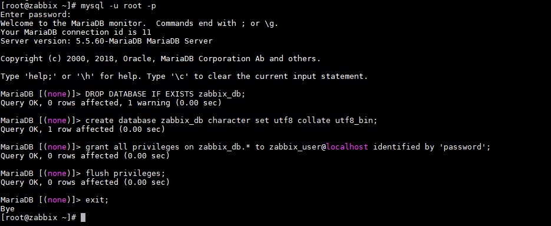
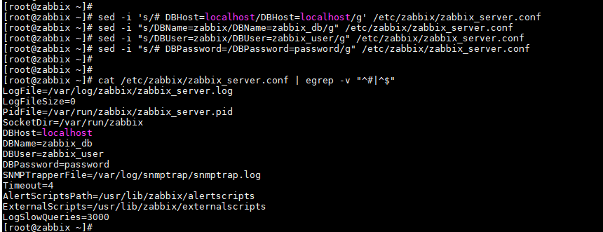

### Mục lục

[1. Mô hình triển khai](#mohinh)<br>
[2. IP Planning](#planning)<br>
[3. Thiết lập ban đầu](#thietlap)<br>
[4. Các bước cài đặt](#cacbuoc)<br>

<a name="mohinh"></a>
## 1. Mô hình triển khai

Mô hình triển khai một node zabbix-server, một hoặc nhiều các host zabbix client.


<a name="planning"></a>
## 2. IP Planning


**Lưu ý**: Bạn có thể tùy chỉnh cấu hình theo số lượng host bạn muốn giám sát. 

<a name="thietlap"></a>
## 3. Thiết lập ban đầu

Cài đặt chuẩn bị server ban đầu bao gồm các thao tác: 

+ Đặt địa chỉ IP tĩnh cho server<br>
+ Đặt host-name<br>
+ Thiết lập firewalld, selinux<br>

Ở màn command line của server bạn thực hiện các câu lệnh dưới.

```
[root@zabbix ~]# nmcli con modify ens160 ipv4.addresses 10.10.10.115/24
[root@zabbix ~]# nmcli con modify ens160 ipv4.gateway 10.10.10.1
[root@zabbix ~]# nmcli con modify ens160 ipv4.dns 8.8.8.8
[root@zabbix ~]# nmcli con modify ens160 ipv4.method manual
[root@zabbix ~]# nmcli con modify ens160 connection.autoconnect yes

[root@zabbix ~]# sudo systemctl disable firewalld
[root@zabbix ~]# sudo systemctl stop firewalld
[root@zabbix ~]# sudo systemctl disable NetworkManager
[root@zabbix ~]# sudo systemctl stop NetworkManager
[root@zabbix ~]# sudo systemctl enable network
[root@zabbix ~]# sudo systemctl start network

[root@zabbix ~]# hostnamectl set-hostname zabbix

[root@zabbix ~]# sed -i 's/SELINUX=enforcing/SELINUX=disabled/g' /etc/sysconfig/selinux
[root@zabbix ~]# sed -i 's/SELINUX=enforcing/SELINUX=disabled/g' /etc/selinux/config
```


Restart lại server để cập nhật cấu hình mới.


+ Update các gói cài đặt

```
[root@zabbix ~]# yum install epel-release
[root@zabbix ~]# yum update -y
```

<a name="cacbuoc"></a>
## 4. Các bước cài đặt

### Bước 1: Download repo zabbix và cài đặt một số package: zabbix-server, mariadb, php, http

```
[root@zabbix ~]# rpm -ivh https://repo.zabbix.com/zabbix/4.0/rhel/7/x86_64/zabbix-release-4.0-1.el7.noarch.rpm
[root@zabbix ~]# yum -y install zabbix-server-mysql zabbix-web-mysql mysql mariadb-server httpd php
```


### Bước 2: Create Database

+ Start service `mariadb` và tự động start khi khởi động lại server.

```
[root@zabbix ~]# systemctl start mariadb
[root@zabbix ~]# systemctl enable mariadb
```

Thiết lập password root cho mysql

```
[root@zabbix ~]# mysql_secure_installation

NOTE: RUNNING ALL PARTS OF THIS SCRIPT IS RECOMMENDED FOR ALL MariaDB
      SERVERS IN PRODUCTION USE!  PLEASE READ EACH STEP CAREFULLY!

In order to log into MariaDB to secure it, we'll need the current
password for the root user.  If you've just installed MariaDB, and
you haven't set the root password yet, the password will be blank,
so you should just press enter here.

Enter current password for root (enter for none):
OK, successfully used password, moving on...

Setting the root password ensures that nobody can log into the MariaDB
root user without the proper authorisation.

Set root password? [Y/n] Y
New password:
Re-enter new password:
Password updated successfully!
Reloading privilege tables..
 ... Success!


By default, a MariaDB installation has an anonymous user, allowing anyone
to log into MariaDB without having to have a user account created for
them.  This is intended only for testing, and to make the installation
go a bit smoother.  You should remove them before moving into a
production environment.

Remove anonymous users? [Y/n]
 ... Success!

Normally, root should only be allowed to connect from 'localhost'.  This
ensures that someone cannot guess at the root password from the network.

Disallow root login remotely? [Y/n]
 ... Success!

By default, MariaDB comes with a database named 'test' that anyone can
access.  This is also intended only for testing, and should be removed
before moving into a production environment.

Remove test database and access to it? [Y/n]
 - Dropping test database...
 ... Success!
 - Removing privileges on test database...
 ... Success!

Reloading the privilege tables will ensure that all changes made so far
will take effect immediately.

Reload privilege tables now? [Y/n]
 ... Success!

Cleaning up...

All done!  If you've completed all of the above steps, your MariaDB
installation should now be secure.

Thanks for using MariaDB!
[root@zabbix ~]#
```

+ Tạo một database cho zabbix

```
[root@zabbix ~]# mysql -u root -p
Enter password:
Welcome to the MariaDB monitor.  Commands end with ; or \g.
Your MariaDB connection id is 11
Server version: 5.5.60-MariaDB MariaDB Server

Copyright (c) 2000, 2018, Oracle, MariaDB Corporation Ab and others.

Type 'help;' or '\h' for help. Type '\c' to clear the current input statement.

MariaDB [(none)]> DROP DATABASE IF EXISTS zabbix_db;
Query OK, 0 rows affected, 1 warning (0.00 sec)

MariaDB [(none)]> create database zabbix_db character set utf8 collate utf8_bin;
Query OK, 1 row affected (0.00 sec)

MariaDB [(none)]> grant all privileges on zabbix_db.* to zabbix_user@localhost identified by 'password';
Query OK, 0 rows affected (0.00 sec)

MariaDB [(none)]> flush privileges;
Query OK, 0 rows affected (0.00 sec)

MariaDB [(none)]> exit;
Bye
[root@zabbix ~]#
```



### Bước 3: Import database zabbix

```
[root@zabbix ~]# cd /usr/share/doc/zabbix-server-mysql-4.0.3
[root@zabbix zabbix-server-mysql-4.0.3]# gunzip create.sql.gz
[root@zabbix zabbix-server-mysql-4.0.3]# mysql -u root -p zabbix_db < create.sql
```


### Bước 4: Config Database

```
[root@zabbix ~]# sed -i 's/# DBHost=localhost/DBHost=localhost/g' /etc/zabbix/zabbix_server.conf
[root@zabbix ~]# sed -i "s/DBName=zabbix/DBName=zabbix_db/g" /etc/zabbix/zabbix_server.conf
[root@zabbix ~]# sed -i "s/DBUser=zabbix/DBUser=zabbix_user/g" /etc/zabbix/zabbix_server.conf
[root@zabbix ~]# sed -i "s/# DBPassword=/DBPassword=password/g" /etc/zabbix/zabbix_server.conf
```



### Bước 5: Configure PHP Setting

```
[root@zabbix ~]# sed -i 's/max_execution_time = 30/max_execution_time = 600/g' /etc/php.ini
[root@zabbix ~]# sed -i 's/max_input_time = 60/max_input_time = 600/g' /etc/php.ini
[root@zabbix ~]# sed -i 's/memory_limit = 128M/memory_limit = 256M/g' /etc/php.ini
[root@zabbix ~]# sed -i 's/post_max_size = 8M/post_max_size = 32M/g' /etc/php.ini
[root@zabbix ~]# sed -i 's/upload_max_filesize = 2M/upload_max_filesize = 16M/g' /etc/php.ini
[root@zabbix ~]# echo "date.timezone = Asia/Ho_Chi_Minh" >> /etc/php.ini
```


### Bước 7: Restart service `zabbix-server`, `http`, `mariadb`

```
[root@zabbix ~]# systemctl start zabbix-server
[root@zabbix ~]# systemctl enable zabbix-server
[root@zabbix ~]# systemctl start httpd
[root@zabbix ~]# systemctl enable httpd
[root@zabbix ~]# systemctl restart zabbix-server
[root@zabbix ~]# systemctl restart httpd
[root@zabbix ~]# systemctl restart mariadb
```


### Bước 8: Truy cập web dashboard zabbix

http://ipserver/zabbix


Các thiết lập ban đầu trên web dashboard zabbix mời các bạn thực hiện theo hướng dẫn ở phần 2.

---
Thực hiện bởi <a href="https://cloud365.vn/" target="_blank">cloud365.vn</a>
